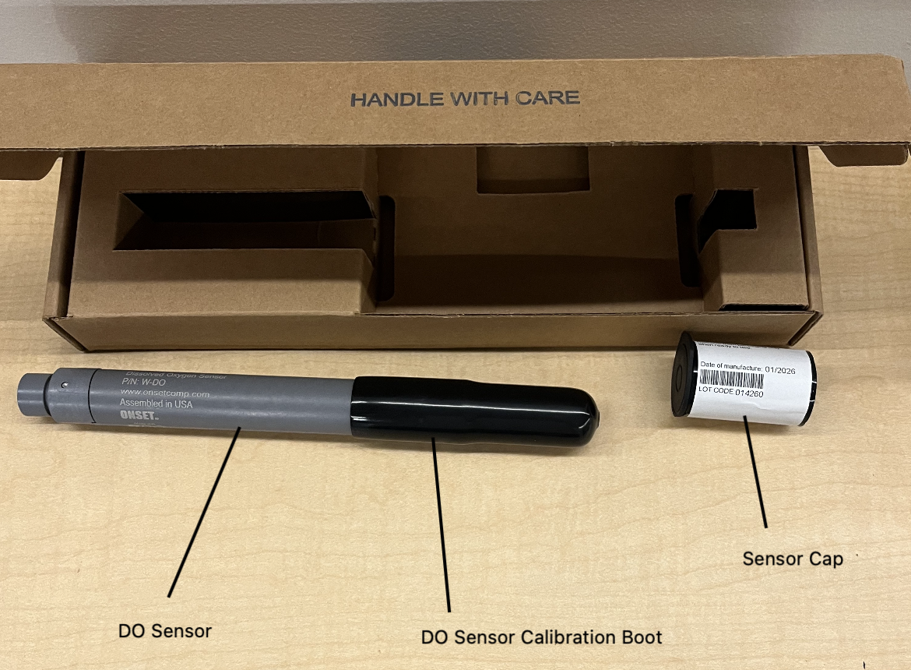
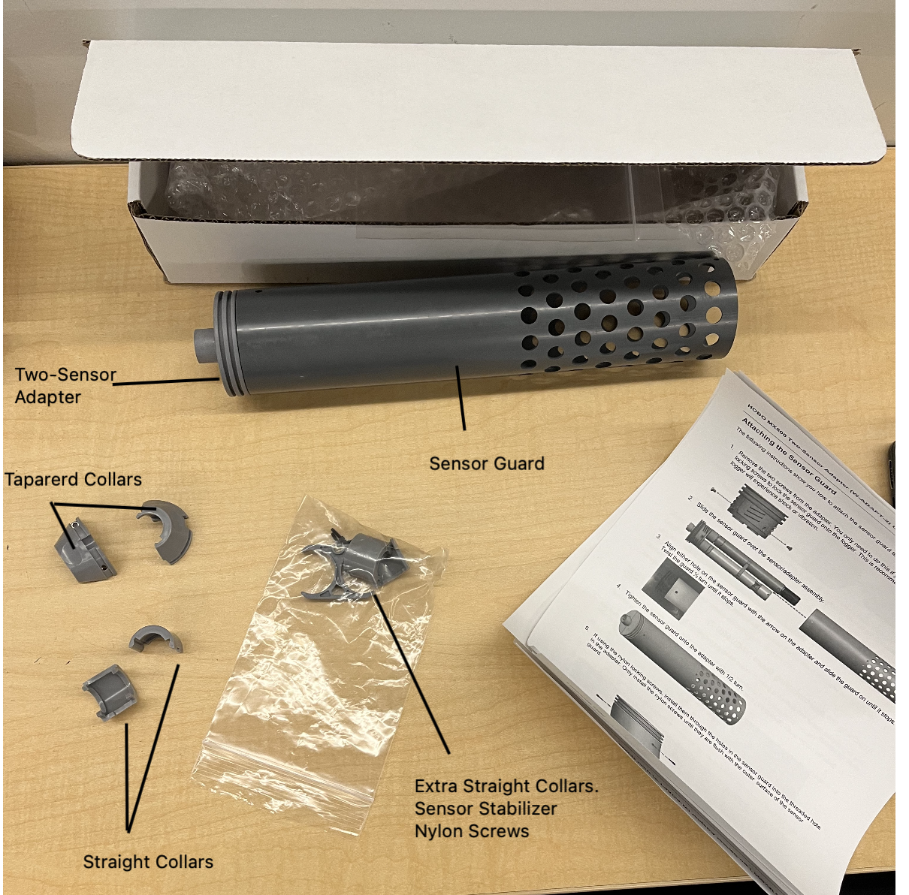
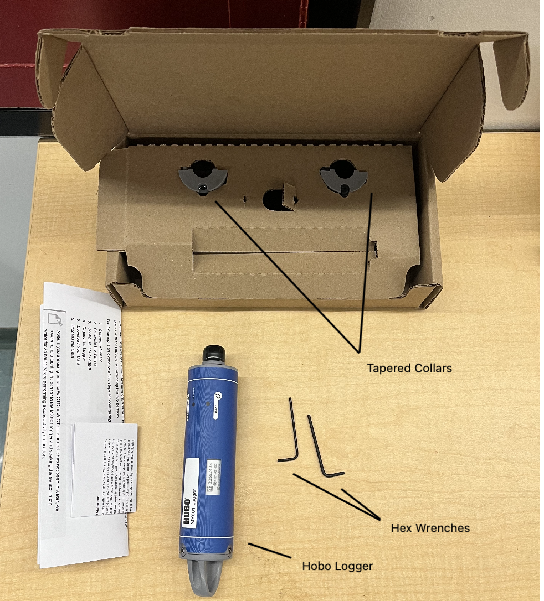

**Step 1: Follow the two guides below to setup the hobo logger and to calibrate the sensor which must be done before assembling the dual adapter**

Note: Download the app do not use the website if possible
[HOBO MX801 Submersible Logger Quick Start Guide](https://www.onsetcomp.com/sites/default/files/2024-03/25705-A%20MAN-MX801-QSG.pdf)

Note: Read the table of contents
Note: Pages 10 and 38
[DO Sensor Setup. DO Sensor Calibration](https://www.onsetcomp.com/sites/default/files/2024-10/25707-B%20HOBO%20MX800%20Series%20User%20Guide.pdf)

**Step 2: Follow the guide below to setup the dual adapter**

Note: Follow the guide below guide after calibration of the sensors, which is done in the guides above.
Note: When the tapered collars are used, you ==MUST== use the tapered collar that comes with the HOBO Logger, not the tapered collar that comes with the dual adapter, or else you will not be able to turn on the logger.
[HOBO Two-Sensor Adapter (W-ADAPT-2) User Guide](https://www.onsetcomp.com/sites/default/files/2024-08/28835-A%20MX800%20Series%20Two-Sensor%20Adapter.pdf)

#### MX801 logger specs
- 1.5 year battery lifespan with 5 minute logging intervals

#### Conductivity sensor specs
- Temperature drift <0.1ºC per year
- Recommends calibrating in the lab

#### DO sensor specs
- Accuracy maintained for 2 years aside from the effects of fouling (replace cap after 2 years)
	- Recommend before a new deployment or install a new DO sensor
- Temperature drift <0.1ºC per year

#### pH sensor specs
- Electrode minimum life span 6 months ([link to replacement](https://www.onsetcomp.com/products/accessories/mx2500-electrode), $139)

#### Depth sensor specs
- Drift <0.5% per year