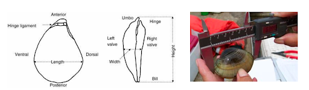
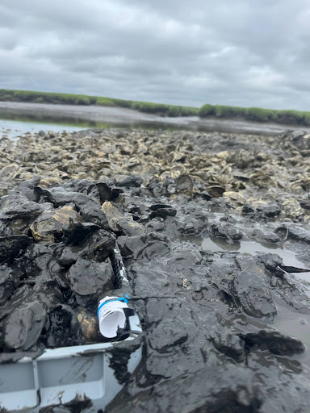
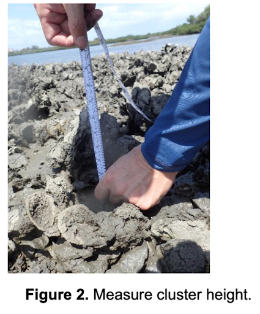

[Biobox Protocol]{.underline}

Last edited spring 26': FMA

**Overview:** The bioboxes and associated environmental parameter measurements allow us to investigate how reef structural characteristics and environmental drivers influence the diversity, composition, and abundance of reef-associated faunal communities.

\_\_\_\_\_\_\_\_\_\_\_\_\_\_\_\_\_\_\_\_\_\_\_\_\_\_\_\_\_\_\_\_\_\_\_\_\_\_\_\_\_\_\_\_\_\_\_\_\_\_\_\_\_\_\_\_\_\_\_\_\_\_\_\_\_\_\_\_\_\_\_\_\_\_\_

***Deployment:***

\*if we decide to participate in marine geo collab use [[these data sheets]{.underline}](https://smithsonian.figshare.com/articles/online_resource/MarineGEO_Oyster_Reef_Habitat_Monitoring_Protocol/14714328?file=63997888) instead for transects/rugosity/ point intercept and read [[this protocol]{.underline}](https://smithsonian.figshare.com/articles/online_resource/MarineGEO_Oyster_Reef_Habitat_Monitoring_Protocol/14714328?file=63989578) as well

Plan to deploy Bioboxes on the lowest tide of June. One site per day. Bioboxes should be deployed in triplicate at each site, at the same relative tidal height, roughly 3m apart. Within the habitat, oysters should be excavated, and bio-boxes placed into the substrate so that the top of the box is mostly level with the substrate. Fill the bio-box with the excavated oysters such that it resembles the density of the oysters in the surrounding habitat.

+-----------------+-------------------------------------------------------------------------------------------------------------------------------------------------------+
| **Print:**      | [[*Biobox deployment field sheet*]{.underline}](https://docs.google.com/spreadsheets/d/1NEiLnoZBNE9a9Xso_CNzmHq-RsiU96dFqjNtYJVxbC8/edit?gid=0#gid=0) |
+:================+:======================================================================================================================================================+
| **Prep/Bring:** | [[Packing list]{.underline}](https://docs.google.com/spreadsheets/d/1NEiLnoZBNE9a9Xso_CNzmHq-RsiU96dFqjNtYJVxbC8/edit?gid=188906768#gid=188906768)    |
+-----------------+-------------------------------------------------------------------------------------------------------------------------------------------------------+

[**Our three established sites:**]{.underline}

Here are the sites, GPS location of previous bioboxes and reefs and parking etc on a map: [[https://maps.app.goo.gl/eUh7fYdza9QcSRhU7]{.underline}](https://maps.app.goo.gl/eUh7fYdza9QcSRhU7)

NSW1: Rowley River, Low tide \~1 hour after Plum Island South

NSW2: Mud Creek \~ 25 mins after Plum Island South

NSW3: Parker River \~ 1 hour after Plum Island South

\*normally meet at parking \~45mins before Plum Island South low tide.

**What you'll do:**

1\. At each site, record **site metadata** and measure environmental conditions (**Salinity, water temp, DO, pH**).

2\. Measure reef height and rugosity (surface complexity).

-   Measure **chain length (cm)**. Record on data sheet.
-   Lay out a 30m transect perpendicular to reef slope. If a patch is too small you can break into k segments.
    -   Record distance which chain reaches, **Chain distance (cm)**
        -   Do this by placing the chain parallel to transect but following the natural ups and downs of the reef (Figure 1.)
    -   Measure **Cluster height (cm)** (Figure2.)
        -   Height of the tallest cluster from the rugosity measurement Measure perpendicular to the substrate.. For bed- or reef-forming oysters, measure from the sediment to the top of the cluster. For encrusting oysters measure from the hard substrate the oysters are growing on to the top of the oyster cluster.

{width="281"}

3\. Take a reef photo(s) to document the site before deployment and after deployment.

-   Good photos capture the following

    -   Show clearly the density of the oyster bed across its variations

    -   Tide height at deployment

    -   Shape/breadth of reef

    -   Sedimentation

    -   Important relocation markers for bioboxes

    -   Anything that stands out to you

    -   Fun photos of us working!

4\. Set up an ENVLogger, attach to one of the three bioboxes. Set it up to pretty dates and to record once every 10 minutes.

-   Record **logger name**

-   **Logger serial \#**

-   **Label of the biobox attached to**

5\. Attach unique labels to each biobox that are written or printed on underwater paper. Recommend something like:

+------------------------------------------------+
| **"Sitecode_year_replicate X"**                |
|                                                |
| **University of Massachusetts Lowell,**        |
|                                                |
| **Dr. Sarah Gignoux-Wolfsohn, (610)-724-3602** |
|                                                |
| **DMF Permit \#**                              |
+:==============================================:+
+------------------------------------------------+

\*We may or may not have a permit number when you are ready to deploy - of not- no worries, leave it off

6\. Deploy the 3 bioboxes per reef. On intertidal reefs select spots exposed at the lowest low tide, but not at the reef crest.

-   Excavate the area where you want to place the biobox using a trowel/claw and gloved hands. Place excavated material into the box. Nestle the box into the reef such that it is level with the rest of the reef. Density in the box should match surroundings.

{width="287"} {width="335"}

Left: Mudcreek Biobox Summer 25' as it is being deployed. Right: Rowley River Biobox, Summer 25'

Note the label zip tied to the right side.

*As of summer 26' not applicable for our UML sites:*

**Low density/ high wave action:** For sites with low oyster cover, placing an excessive amount of material in the bio-box could lead to inflated counts. In high wave areas, bio-boxes can be secured with rebar or plastic dowels, though in general, the weight of the oysters inside the box is sufficient to hold them in place. Rebar can also be zip-tied to the box to increase weight to assist in securing the bio-box in place.

7\. Mark the coordinates of each biobox on the fieldsheet, drop pins on to shared google map

-   **Record coordinates for 3 boxes**

8\. Take photos of bioboxes in situ, including any helpful relocation markers (big boulder? Unique tree?)

9\. Take notes on observations, how long things took, did you hit the tide right? Etc.

10\. Take a data sheet photo

[**Deployment Data Management**]{.underline}

+------------------------------------------------------+--------------+--------------------------------------------------------------------------------------------------------------------------------------+-----------------------------+
| Data generated                                       | Location     | Path                                                                                                                                 | Notes                       |
+======================================================+==============+======================================================================================================================================+=============================+
| **Data sheet photo**                                 | Google drive | [[HERE]{.underline}](http%20s://drive.google.com/%20drive/folders/1TqxBFG%20NZ4bEK4HiyzwmULYHz_XX%20T6Hw1?usp=drive_link)            | Relabel with \              |
|                                                      |              |                                                                                                                                      | "site \_date_datasheet"     |
+------------------------------------------------------+--------------+--------------------------------------------------------------------------------------------------------------------------------------+-----------------------------+
| **Reef and biobox photos**                           | Google drive | **NSW1\>** [[HERE]{.underline}](http%20s://drive.google.com/%20drive/folders/1n-Fe0-%20dufJFdRI5VgMi54nYODHL%20vJX4M?usp=drive_link) | Make subfolder with mm_yyyy |
|                                                      |              |                                                                                                                                      |                             |
|                                                      |              | **NSW2\>** [[HERE]{.underline}](http%20s://drive.google.com/%20drive/folders/1cssvBw%20nlFokKbI54918FD08s9PM%20B_a2q?usp=drive_link) |                             |
|                                                      |              |                                                                                                                                      |                             |
|                                                      |              | **NSW3\>** [[HERE]{.underline}](http%20s://drive.google.com/%20drive/folders/1oGdaFu%20jSSJnRclBPacRdC1EP0Q5%20ocQHN?usp=drive_link) |                             |
+------------------------------------------------------+--------------+--------------------------------------------------------------------------------------------------------------------------------------+-----------------------------+
| **Metadata**                                         | Github       | PIC\> Biobox /biobox_metadata.csv                                                                                                    |                             |
+------------------------------------------------------+--------------+--------------------------------------------------------------------------------------------------------------------------------------+-----------------------------+
| **Environmental Measurements (salinity, DO etc...)** | Github       | PIC_Orion.csv                                                                                                                        |                             |
+------------------------------------------------------+--------------+--------------------------------------------------------------------------------------------------------------------------------------+-----------------------------+
| **Rugosity**                                         | Github       | PIC\> Biobox /biobox_rugosity.csv                                                                                                    |                             |
+------------------------------------------------------+--------------+--------------------------------------------------------------------------------------------------------------------------------------+-----------------------------+
| **ENVLogger info**                                   | Github       | MegaMetaData\> LoggerTracker.csv                                                                                                     |                             |
+------------------------------------------------------+--------------+--------------------------------------------------------------------------------------------------------------------------------------+-----------------------------+

***Retrieval:***

Two months after deployment, on the lowest tide of August, plan to retrieve the bioboxes!

+-----------------+-----------------------------------------------------------------------------------------------------------------------------------------------------------------------------------------------+
| **Print:**      | 1.  [Biobox collection fieldsheet](https://docs.google.com/spreadsheets/d/1FG0%20SdEHlbd-jxLbGdDDC7tWhm_0DgvNg7F9ZzEwyX9M/edit?gid=0#gid=0)                                                   |
|                 |                                                                                                                                                                                               |
|                 | 2.  [[Mobile \> Fauna]{.underline}](h%20ttps://docs.google.com/spreadsheets/d/1FG0SdEHlbd-jxLbGdDD%20C7tWhm_0DgvNg7F9ZzEwyX9M/edit?gid=806521607#gid=806521607) \> *x3 per site*              |
|                 |                                                                                                                                                                                               |
|                 | 3.  [[Sessile \> Fauna]{.underline}](h%20ttps://docs.google.com/spreadsheets/d/1FG0SdEHlbd-jxLbGdDD%20C7tWhm_0DgvNg7F9ZzEwyX9M/edit?gid=330626640#gid=330626640) \> *x3 per site*             |
|                 |                                                                                                                                                                                               |
|                 | 4.  [[Bivalve Height+ \> Weight]{.underline}](htt%20ps://docs.google.com/spreadsheets/d/1FG0SdEHlbd-jxLbGdDDC7%20tWhm_0DgvNg7F9ZzEwyX9M/edit?gid=2005537187#gid=2005537187) \> *x 3 per site* |
+=================+===============================================================================================================================================================================================+
| **Prep/Bring:** | [[Packing list]{.underline}](htt%20ps://docs.google.com/spreadsheets/d/1FG0SdEHlbd-jxLbGdDDC7%20tWhm_0DgvNg7F9ZzEwyX9M/edit?gid=1283800924#gid=1283800924)                                    |
+-----------------+-----------------------------------------------------------------------------------------------------------------------------------------------------------------------------------------------+

***Biobox Collection:***

-   Take environmental measurements. Record on **Retrieval Metadata Fieldsheet**

-   Take photos of the reef

    -   Recolate first biobox at a site. Lift the bio-box and immediately place it in a large bin. For subtidal sites, place the lid over the bio-box before removing the bio-box from the substrate and return to the surface to place within the bin.

-   Assign individuals to each taxonomic group: oysters, other bivalves, crabs, worms, snails, shrimp, arthropods/isopods, sessile organisms attached to other organisms, etc.

***Mobile and Sessile Fauna (+ Bivalve weight):***

Weigh an empty bucket and note weight on **BioBox Retrieval Fieldsheet : Bivalve Height**

1.  **Mobile:** Once your bin is on shore carefully pick through the material in the biobox to collect all associated macrofauna.

    a.  Mobile fauna should be identified to the lowest possible taxonomic level and tallied into size class on the **Mobile Fauna Fieldsheet**
        a.  If you find a new organism take a photo and collect a type specimen in 100% ethanol label the tube and mark the label on the fieldsheet.

            If you can't figure out what something is, make a note, any observations, tally it in appropriate size class. Take a photo and preserve the specimen in 100% EtOH, labeling the tube and marking the label on the fieldsheet.

*You might find it helpful to rinse off oyster clumps over the sorting tray or a sieve to dislodge mobile fauna as best you can.*

2.  **Sessile:** Check out the surface of each oyster and tally and identify all sessile fauna to the lowest taxonomic unit. No need to remove it from oyster shells or size class it.

3.  Place all **Bivalves** into the bucket you weighed. This will include all live bivalves and dead whole shells that are above 15 mm in height (not including cultch (single shell) and shell hash (shell fragments).

4.  Get **Bivalve Weight.** Weigh bucket with all bivalves. Record on **BioBox Retrieval Fieldsheet : Bivalve Height+Weight .**

***Bivalve height + density:***

1.  Randomly select **50 live oysters and** up to **25** **other live bivalves** over 15mm from each biobox. Measure the height of each of these bivalves. (See figure 3.) Record on **BioBox Retrieval Fieldsheet : Bivalve Height+Weight.**

2.  Count and tally all remaining oysters. Separately Count and tally all remaining bivalves.

Figure 3. Shows how we measure for oysters vs. clams.

[**Retrieval Data Management**]{.underline}

+------------------------------------------------------+----------------+---------------------------------------------------------------------------------------------------------------------+-------------------------------------------------------+
| ***Data generated***                                 | ***Location*** | ***Path***                                                                                                          | ***Notes***                                           |
+======================================================+================+=====================================================================================================================+=======================================================+
| **Data sheet photo**                                 | Google drive   | [Here](https://drive.googl%20e.com/drive/folders/1Tq%20xBFGNZ4bEK4HiyzwmULYHz_%20XXT6Hw1?usp=drive_link)            | Relabel with\                                         |
|                                                      |                |                                                                                                                     | "site_date_datasheet"                                 |
+------------------------------------------------------+----------------+---------------------------------------------------------------------------------------------------------------------+-------------------------------------------------------+
| **Reef and biobox photos**                           | Google drive   | **NSW1\>** [Here](https://drive.googl%20e.com/drive/folders/1n-%20Fe0-dufJFdRI5VgMi54nYOD%20HLvJX4M?usp=drive_link) | Make subfolder with mm_yyyy                           |
|                                                      |                |                                                                                                                     |                                                       |
|                                                      |                | **NSW2\>** [Here](https://drive.googl%20e.com/drive/folders/1cs%20svBwnlFokKbI54918FD08s9%20PMB_a2q?usp=drive_link) |                                                       |
|                                                      |                |                                                                                                                     |                                                       |
|                                                      |                | **NSW3\>** [Here](https://drive.googl%20e.com/drive/folders/1oG%20daFujSSJnRclBPacRdC1EP0%20Q5ocQHN?usp=drive_link) |                                                       |
+------------------------------------------------------+----------------+---------------------------------------------------------------------------------------------------------------------+-------------------------------------------------------+
| **Metadata**                                         | Github         | PIC\> Biobox /biobox_metadata.csv                                                                                   |                                                       |
+------------------------------------------------------+----------------+---------------------------------------------------------------------------------------------------------------------+-------------------------------------------------------+
| **Environmental Measurements (salinity, DO etc...)** | Github         | PIC_Orion.csv                                                                                                       |                                                       |
+------------------------------------------------------+----------------+---------------------------------------------------------------------------------------------------------------------+-------------------------------------------------------+
| **Total bivalve weight**                             | Github         | PIC\>Biobox\                                                                                                        |                                                       |
|                                                      |                | /biobox_r etrieval_bivalve_weight                                                                                   |                                                       |
+------------------------------------------------------+----------------+---------------------------------------------------------------------------------------------------------------------+-------------------------------------------------------+
| **First 50 oyster height**                           | Github         | PIC\> Bioboxbiobox_retrieval \_bivalve_height.csv                                                                   |                                                       |
+------------------------------------------------------+----------------+---------------------------------------------------------------------------------------------------------------------+-------------------------------------------------------+
| **All other bivalve inside box height**              | Github         | PIC\> Bioboxbiobox_retrieval \_bivalve_height.csv                                                                   | Same as above                                         |
+------------------------------------------------------+----------------+---------------------------------------------------------------------------------------------------------------------+-------------------------------------------------------+
| **Mobile fauna**                                     | Github         | PIC\> Biobox /biobox \_retrieval_mobile_fauna                                                                       |                                                       |
+------------------------------------------------------+----------------+---------------------------------------------------------------------------------------------------------------------+-------------------------------------------------------+
| **Sessile fauna**                                    | Github         | PIC\> Biobox\                                                                                                       |                                                       |
|                                                      |                | /biobox_retrieval_sessile_fauna.csv                                                                                 |                                                       |
+------------------------------------------------------+----------------+---------------------------------------------------------------------------------------------------------------------+-------------------------------------------------------+
| **ENVLogger info**                                   | Github         | MegaMetaData\> LoggerTracker.csv                                                                                    | Update the date data was downloaded                   |
+------------------------------------------------------+----------------+---------------------------------------------------------------------------------------------------------------------+-------------------------------------------------------+
| **Actual temperature data**                          | Github         | PIC\> Temperature_Data                                                                                              | Make sure no overlapping days/ time with current data |
|                                                      |                |                                                                                                                     |                                                       |
|                                                      |                | **NSW1:** rowleyriver \_NSW1_temp.csv\                                                                              |                                                       |
|                                                      |                | **NSW2:** mudcreek_NSW2_temp.csv\                                                                                   |                                                       |
|                                                      |                | **NSW3:** parkerriver_NSW3_temp.csv                                                                                 |                                                       |
+------------------------------------------------------+----------------+---------------------------------------------------------------------------------------------------------------------+-------------------------------------------------------+
