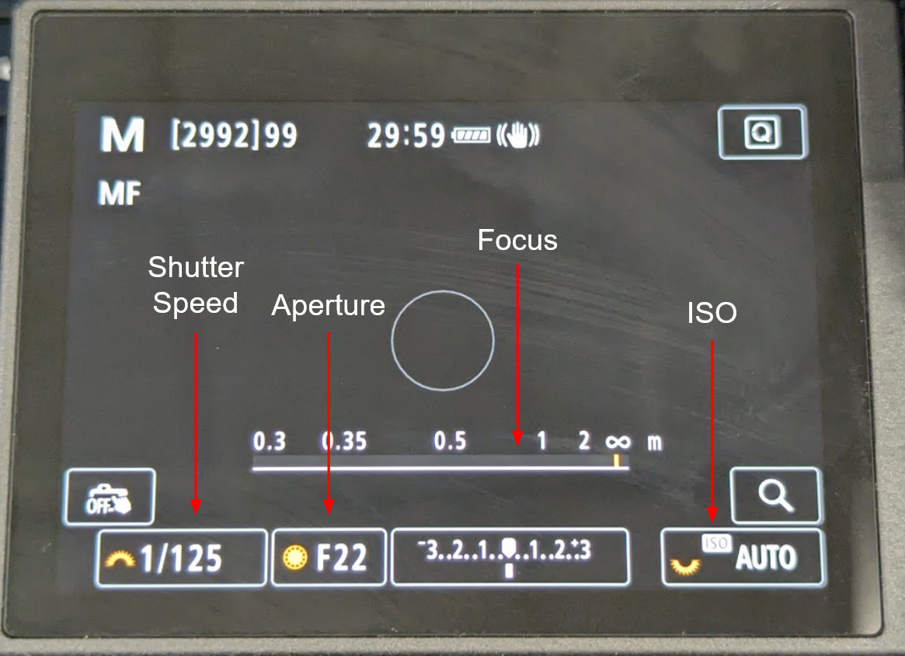

## Terms
- **ISO** = camera's sensitivity to light
	- High ISO 
		- Brighter image
	- Low ISO 
		- Darker image
- **Aperture** = how much light the camera lets in 
	- Low f-stop: 
		- Brighter 
		- Shallow depth of field 
	- High f-stop: 
		- Darker 
		- Deep depth of field 
- **Shutter Speed** = how long the shutter is open for
	- Quick (1/2000 sec)
		- Freezes fast moving subjects
	- Slow (1 sec)
		- Blurs moving subjects
	- 1/60 to 1/250 will likely be used the most
- **Focus** = determines how clear or blurry the subject is
	- Measured in the distance between the lens and the subject 
		- If a subject is 0.5 meters away, the subject will likely become clear when the focus is set to around 0.5 meters (often not exact)
- Reference image for where these settings are located 
	- 
	- Aperture, shutter speed, and ISO can be changed via the touchscreen 
	- Focus can be changed via the focus ring on the lens
## Image Quality
- Understanding image quality 
	- Resolution sizes: 
		- Large (L), medium (M), and small (S) 
			- Higher (larger) resolution = higher quality
	- Compression types:
		- Quarter circle = smooth details
		- Stair = pixelated details
- Changing image quality
	- First way: 
		1. Press q button 
		2. Navigate down to image quality 
		3. Select image quality
	- Second way: 
		1. Press menu button 
		2. Navigate to section with camera icon (red)
		3. Go to page 1 
		4. Select image quality 
## Uploading Photos
1. Take SD card out of the camera 
	- Compartment located on the right side of the camera 
	- Gently press on the SD card to unlock it from its slot
2. Insert SD card into the card reader 
	- Image on the card reader demonstrates the correct way to insert the SD card 
3. Plug the card reader into the computer 
4. Open File Explorer 
5. Path to the photos folder is "E:\DCIM\100CANON"
	- Path can be entered into address bar 
	- Or navigated to manually:
		1. Open the drive labeled "EOS_DIGITAL (E:)"
		2. Open "DCIM" folder 
		3. Open "100CANON" folder
- When ready to remove the SD card, close all related folders, right click on the "EOS_DIGITAL (E:)" drive and select eject, and then remove the SD card from the reader
## Setup for Oyster Shell Pictures
- Camera: 
	- Mode = Manual 
	- Aperture = F22
	- ISO = Auto
	- Shutter Speed = 1/125
	- Focus = 0.35 to 0.5 
		- Adjust as needed until both shells are equally focused
- Stage: 
	- Both overhead lights on
		- Adjust as needed to reduce any shadows in frame
	- Camera mounted all the way to the left 
	- Mount is set to 9 inches upwards
