**Teresa Vaillancourt 2025**
Last updated: January 6, 2026 - JF
### Download software
1. Download the FIJI version of ImageJ (https://imagej.net/software/fiji/downloads)
2. Open the zip file and move the Fiji folder to your desktop
	- If you open this folder, you can see the application you will click to open the software—**DO NOT MOVE THIS**
	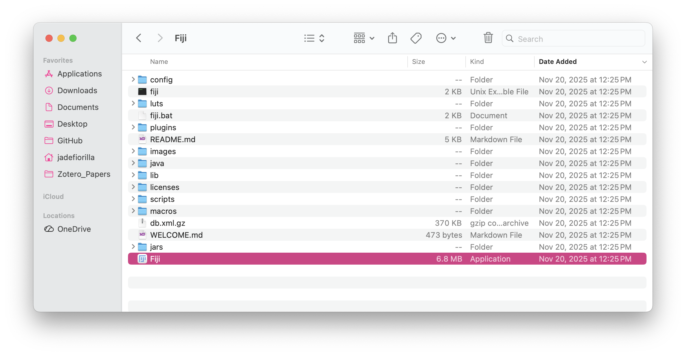
3. Download `ShellAreasTrainSIOX_Batch_2025.ijm` and `ShellAreasApplySIOX_Batch_25Oct2025.ijm` from [GW Lab protocols repository](https://github.com/GWLab-UML/Protocols/tree/main/Oyster_labwork)
	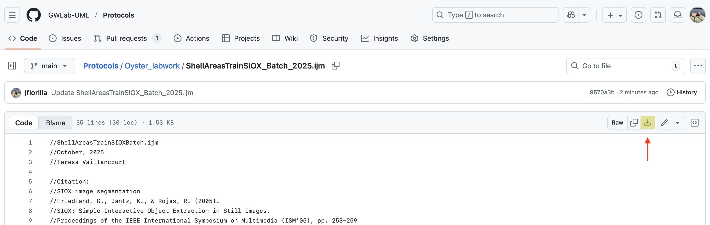

4. Move both `ShellAreasTrainSIOX_Batch_2025.ijm` and `ShellAreasApplySIOX_Batch_25Oct2025.ijm` into Fiji folder > macros
	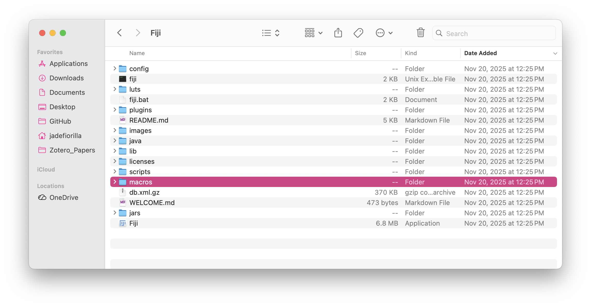
5. The macros folder should now look like this:
	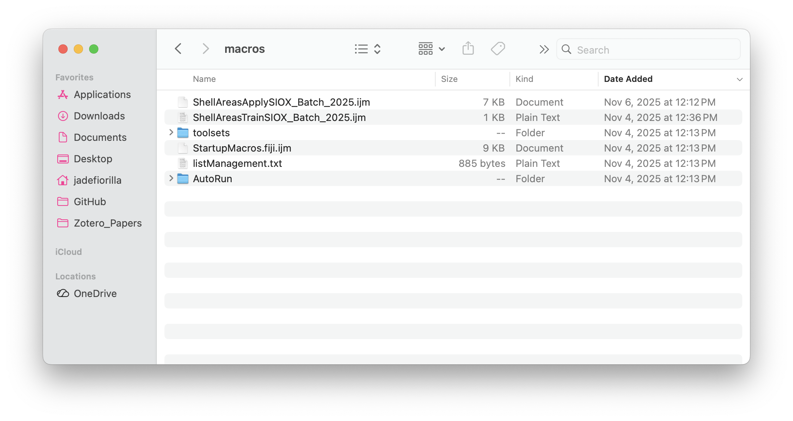

### Prepare photos
1. Create a new folder on your desktop and name it `Shell_processing`
2. Download shell photos from the Google Drive
	- Only work on one site at a time to keep things organized
	- The shell photos must be properly labelled on the Google Drive before downloading
	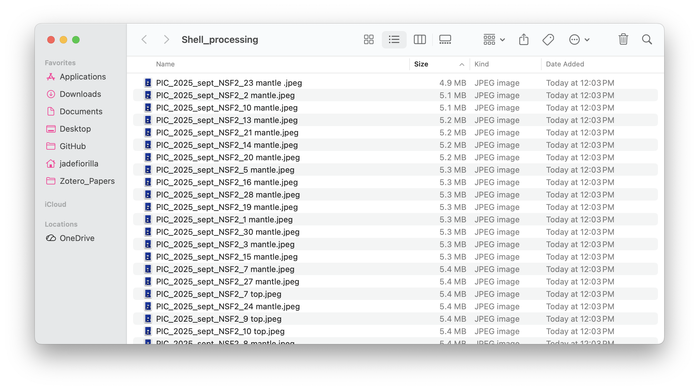
3. Open the zip file and transfer all of the shell photos into your new `Shell_processing` folder
	
4. Delete all the photos of the inside of the shell; we want use the exterior of the shell for measurements
	- If using a Mac, you can hold the command key to select more than one photo at a time
5. Check that all of the photos have the same dimensions and orientation because otherwise the macro will throw errors later
6. Open FIJI and click File > Import > Image Sequence...
7. In the pop-up window, set the directory to the `Shell_processing` folder and set the scale to 50%
	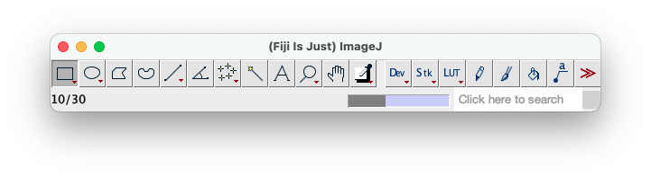
	- This import may take around 30 seconds so just be patient! There is also a progress bar at the bottom of the FIJI toolbox
	- Once complete, the images are now in a "stack" that you can scroll through with your mouse—this format will allow you to perform batch operations
8. Adjust photos as needed: 
	- **Rotate** photos by clicking Image > Transform > Rotate... 
	- **Crop** photos to make them easier to process (i.e. faster) by drawing a rectangle over the area of interest. Scroll through the whole stack to make sure the rectangle doesn't cut any shells in half. Click Image > Crop
		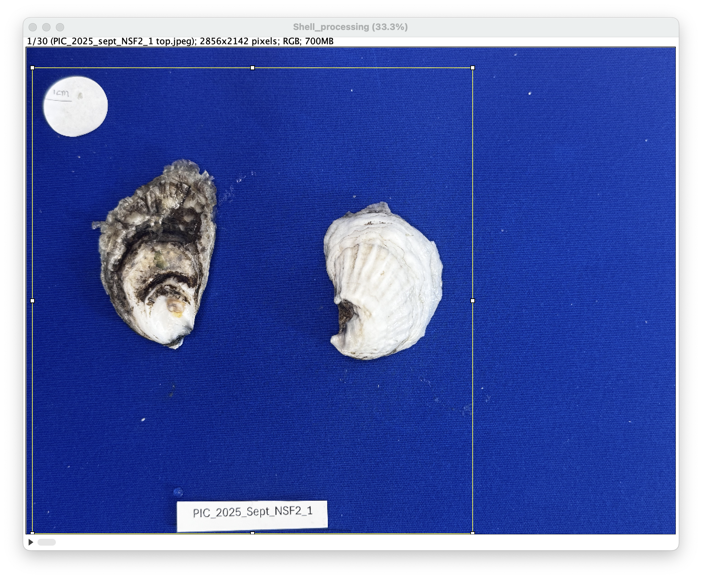
9. Save this stack into your `Shell_processing folder` as a .tif file
10. Use the circle tool to outline the scale dot and click `Command+m` to measure the area. Record this value, as you will use it to set a minimum allowable size when applying the macro
	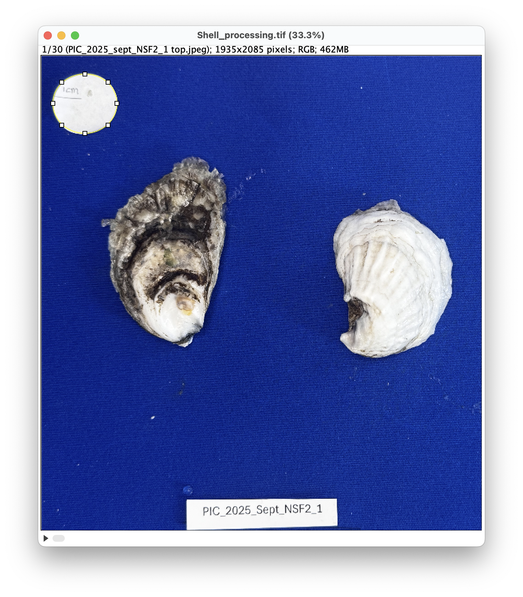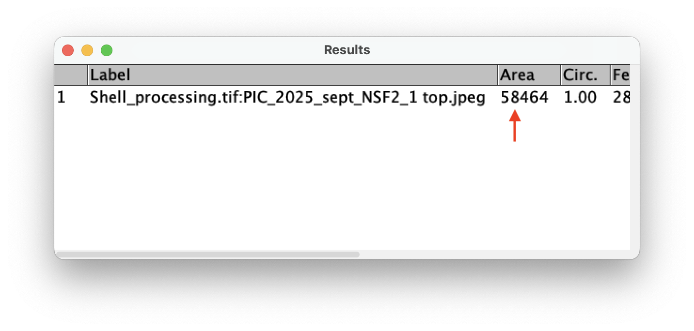
### Train macro
The [SIOX segmentor plugin](https://imagej.net/plugins/siox) must first be told what is foreground (shell) vs. background in our pictures.1

1. In FIJI, click File > Open... then navigate to the Fiji folder which should be saved to your desktop, open the macro folder, and select the `ShellAreasTrainSIOX_Batch_2025.ijm`
2. In the pop-up window click `Run` to start the macro
	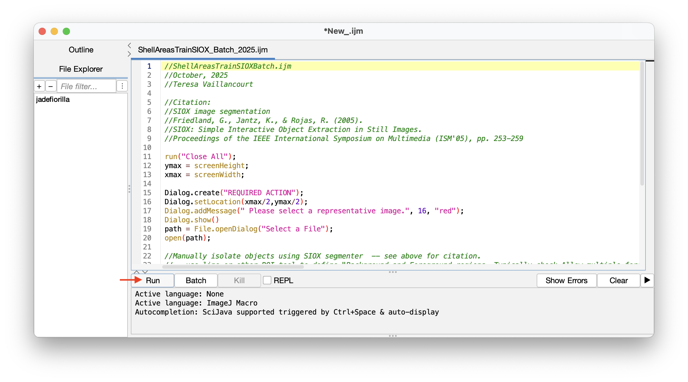
3. When you are prompted to select a representative image, navigate to the `Shell_processing` folder and choose a picture that has a range of light and dark coloration. In the pop-up window, tick the "Allow multiple foreground components" and then draw a line through parts of the shell that includes as much variation as possible
	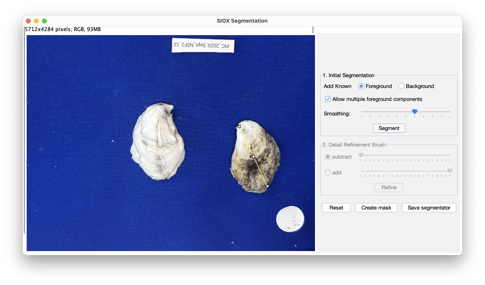
	- This is an example of a good representative image. Notice that the yellow line drawn on the left valve goes through areas of light and dark shell
4. Click `Segment` at the bottom of the pop-up window to see what the mask will look like
	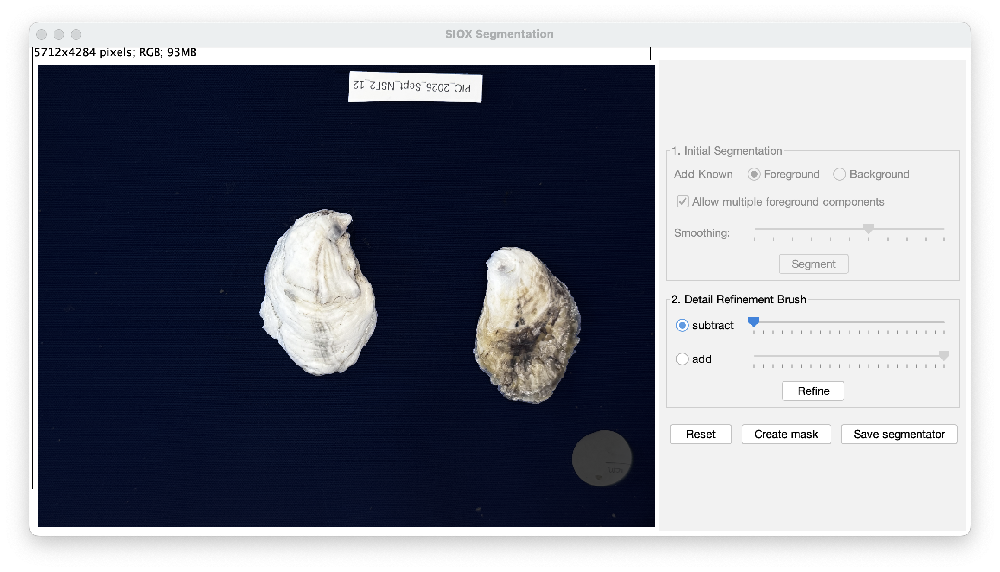
	- This is an example of a good mask! The shells are clearly highlighted as the foreground, and the background is blacked out. It is okay if the labels are included in the mask; there are other filters we will apply later to exclude them from our measurements
	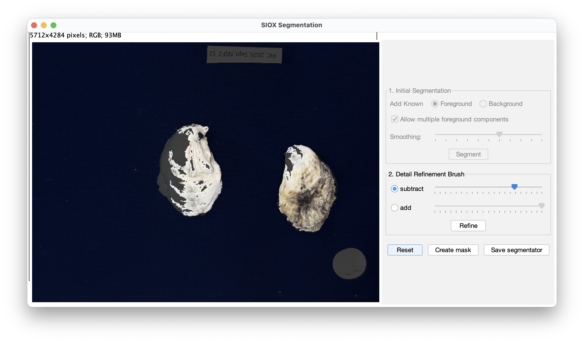
	- This is an example of a poor mask, since the complete shell is not including in the foreground. You can try to refine using the subtract and add functions, but in my experience it is easier to use the `Reset` button and try a new segmentation line. You can define the known background in addition to the foreground. If all else fails, I would close the segmentator and re-run the macro
5. Once you have a suitable mask, click `Save segmentator` and rename the file "Segmentor"
	- For some reason there's a glitch if you don't rename the file so be sure to do this step!
6. Click OK on the initial pop-up window to end the macro

### Apply macro 
1. In FIJI, click File > Open... then navigate to the Fiji folder which should be saved to your desktop, open the macro folder, and select the `ShellAreasApplySIOX_Batch_2025.ijm`
2. In the pop-up window click `Run` to start the macro
3. Confirm the name of the data set, the image directory is `Shell_processing`, the image type is tif, and the segmentor file is the one just made. Set the lower limit to the previously measured scale dot and the upper limit to 13 million. Set the circularity limit to 0.55
	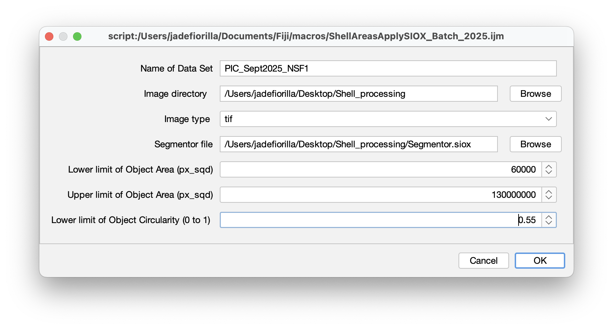
4. Click OK since we already cropped prepared our pictures