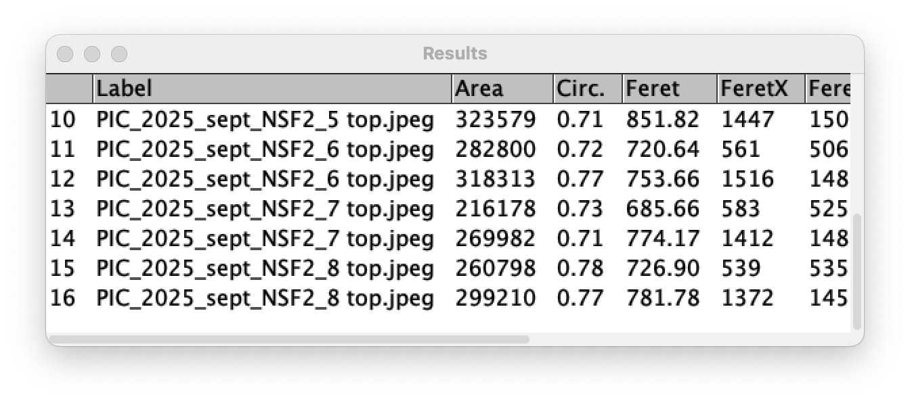
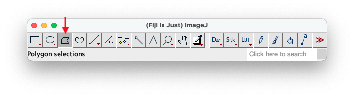
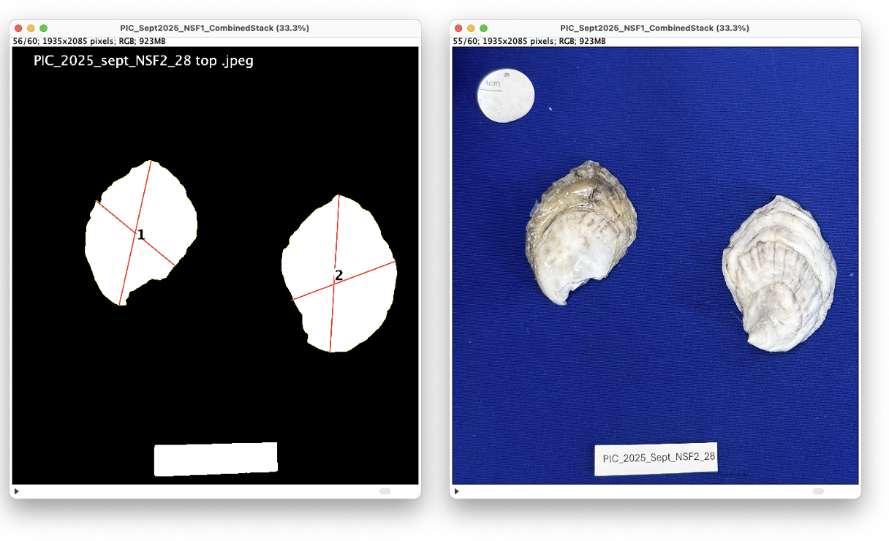
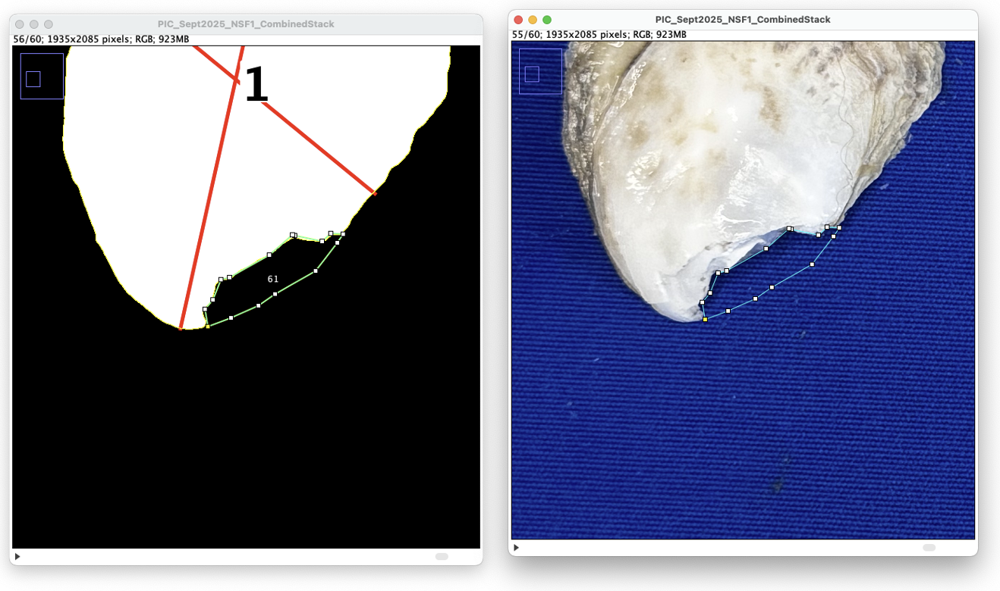
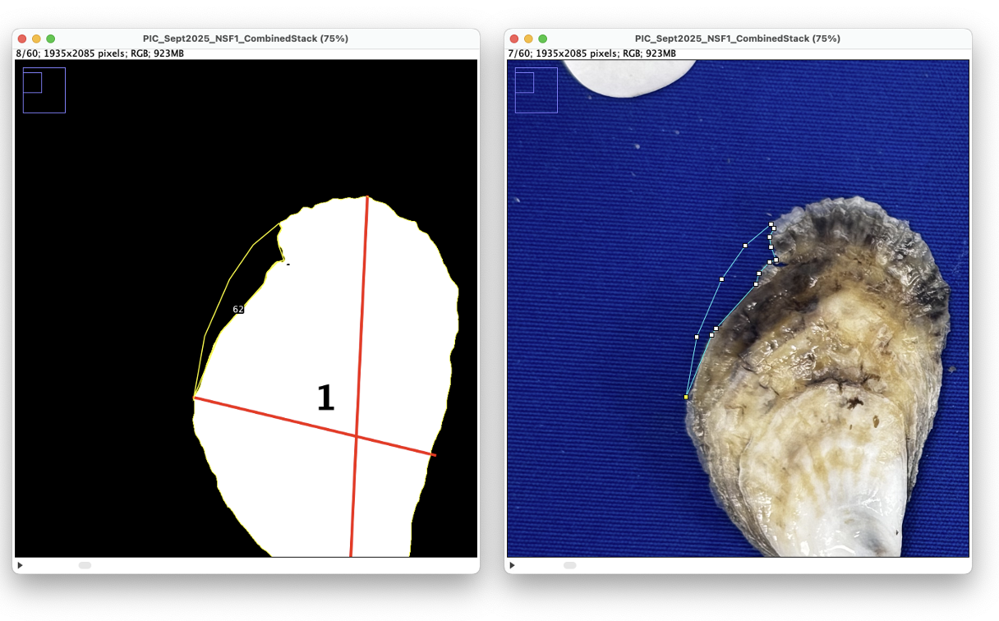
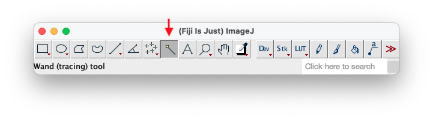

**Teresa Vaillancourt 2025** (her original protocol and documentation can be found [here](https://drive.google.com/drive/folders/1MsG1CK8_EYU03sJPXVaZvV-XPU_0N3Mi?usp=share_link))
Last updated: January 14, 2026 - JF
### Download software
1. Download the FIJI version of ImageJ (https://imagej.net/software/fiji/downloads)
2. Open the zip file and move the Fiji folder to your desktop
	- If you open this folder, you can see the application you will click to open the software—**DO NOT MOVE THIS**
	
3. Download `ShellAreasTrainSIOX_Batch_2025.ijm` and `ShellAreasApplySIOX_Batch_25Oct2026.ijm` from [GW Lab protocols repository](https://github.com/GWLab-UML/Protocols/tree/main/Oyster_labwork)
	
	- There is also a 2025 version of the ApplySIOX_Batch macro; this is still functional and optimized for analyzing image sequences (i.e. individual .jpeg images within a folder) 
	- In this protocol, we first prepare the images and save them as a stack (i.e. a .tif file) which we then use with the macro, thus necessitating this updated 2026 version

4. Move both `ShellAreasTrainSIOX_Batch_2025.ijm` and `ShellAreasApplySIOX_Batch_25Oct2026.ijm` into Fiji folder > macros
	

### Prepare photos
1. Create a new folder on your desktop and name it `Shell_processing`
2. Download shell photos from the Google Drive
	- Only work on one site at a time to keep things organized
	- The shell photos must be properly labelled on the Google Drive before downloading
	
3. Open the zip file and transfer all of the shell photos into your new `Shell_processing` folder
	
4. Delete all the photos of the inside of the shell; we want use the exterior of the shell for measurements
	- If using a Mac, you can hold the command key to select more than one photo at a time

*Note: while you could do all of the following steps within the macro itself, I find the user interface finicky and easy to accidentally quit out of which can lead to lots of frustration. Instead, I like to save an already prepared .tif file to minimize working within the macro*

6. Open FIJI and click File > Import > Image Sequence...
7. In the pop-up window, set the directory to the `Shell_processing` folder, the count to the number of photos to be analyzed within the folder, and the scale to 50%
	
	- This import may take around 30 seconds so be patient! There is also a progress bar at the bottom of the FIJI toolbox
	- Once complete, the images are now in a "stack" that you can scroll through with your mouse—this format will allow you to perform batch operations
8. Adjust photos as needed: 
	- **Rotate** all of the photos by clicking Image > Transform > Rotate... 
	- **Crop** all of the photos to make them easier to process (i.e. faster) by drawing a rectangle over the area of interest. Scroll through the whole stack to make sure the rectangle doesn't cut any shells in half. Click Image > Crop
		
9. Save this stack into your `Shell_processing folder` as a .tif file
10. Select the circle tool from the FIJI toolbox to outline the scale dot and click `Command+m` to measure the area—this can be a rough measurement. Record this value, as you will use it to set a minimum allowable size when applying the macro
	
	- Note that this measurement is in the units pixels^2
11. Close all open windows (File > Close All)

### Train macro
*The [SIOX segmentor plugin](https://imagej.net/plugins/siox) must first be told what is foreground (shell) vs. background in our pictures. If all the photos to be analyzed are taken using the same protocol and have similar coloration (i.e. lighting, background color, etc.) you should only have to perform this step once for all future analyses.*

1. In FIJI, click File > Open... then navigate to the Fiji folder which should be saved to your desktop, open the macro folder, and select `ShellAreasTrainSIOX_Batch_2025.ijm`
2. In the pop-up window click `Run` to start the macro
	
3. When you are prompted to select a representative image, navigate to the `Shell_processing` folder and choose a picture that has a range of light and dark coloration. In the pop-up window, tick the "Allow multiple foreground components" and then draw a line through parts of the shell that includes as much variation as possible
	
	- This is an example of a good representative image. Notice that the yellow line drawn on the left valve goes through areas of light and dark shell
4. Click `Segment` at the bottom of the pop-up window to see what the mask will look like
	
	- This is an example of a good mask! The shells are clearly highlighted as the foreground, and the background is blacked out. It is okay if the labels are included in the mask; there are other filters we will apply later to exclude them from our measurements
	
	- This is an example of a poor mask, since the complete shell is not including in the foreground. You can try to refine using the subtract and add functions, but in my experience it is easier to use the `Reset` button and try a new segmentation line. You can also try to define the known background in addition to the known foreground. If all else fails, I would close the segmentator and re-run the macro
	- More documentation can be found [here](https://imagej.net/plugins/siox)
5. Once you have a suitable mask, click `Save segmentator` and rename the file "Segmentor"
	- For some reason there's a glitch if you don't rename the file so be sure to do this step!
6. Click OK on the initial pop-up window to end the macro

### Apply macro 
1. In FIJI, click File > Open... then navigate to the Fiji folder which should be saved to your desktop, open the macro folder, and select `ShellAreasApplySIOX_Batch_2026.ijm`
2. In the pop-up window click `Run` to start the macro
3. Confirm the name of the data set, the image directory is `Shell_processing`, the previously created .tif file is selected, and that the segmentor file is the most recent/accurate mask. Set the lower limit to the previously measured scale dot (see [Prepare photos](#Prepare%20photos) step 10) and the upper limit to 13 million. Set the circularity limit to 0.55
4. In the next pop-up window click OK since our images are already prepared
5. The segmentor is now going to process all the photos, creating masks of just the shell, and then a different FIJI program called Analyze Particles is going to be called by the macro to measure the length and width of each shell. A `Results` window should appear and populate with measurements as the macro progresses
	
	- This can take 1-2 minutes depending on the size of the images (i.e. 30x 2MB images will take longer than 30x 700KB images)
6. After the Combined Stack image has been formed, which includes both the original image and its labelled mask, the macro is paused so we can scroll through the stack to identify and correct any problems
	- Holes, or black areas completely enclosed by the white shell mask, are not a problem as they are included in the calculated area
	- Missing shell not identified by the macro can be outlined using the polygon tool in the FIJI toolbox, and then measured and added to the results table by clicking `Command+m`
		- Hold the `Ctrl` key and scroll to zoom in/out
		- While tracing missing shell, you can scroll between the original image and the mask to get the best possible estimate
		
		
		- Best to check by the umbo, but also the fringe!
		
	- If area is overestimated by the mask (i.e. a juvenile is stuck on one of the shells and extends beyond the adult shell) you should also measure that estimated area to subtract from the total shell area later
7. Next, using the wand tool click on one of the calibration dots. Once outlined in yellow, double click the wand tool on the FIJI toolbox and use the tolerance scroll bar to further finesse the outline. Measure this selection (`Command+m`)
	
8. Once all extra measurements have been made, click OK to create a .csv file with the results and a .txt file with the parameters used. The macro will automatically do this, and save it in the `Shell_processing` folder
	- If the macro window has disappeared (this is what I mean when I said it's finicky) you can still save the results window with all of your measurements—to interpret:
		- Feret = Length (in px)
		- MinFeret = Width (in px)

And voila! Now all of the raw shell measurements are in a handy .csv file that can be further analyzed. I would recommend keeping all of the .tif files and moving them to a more permanent folder either on Google Drive or GitHub. The Combined Stack .tif may be helpful when interpreting the data, especially when reconciling any missing or overestimated shell areas. Otherwise, the individual .jpeg images should be deleted to make room for a new batch