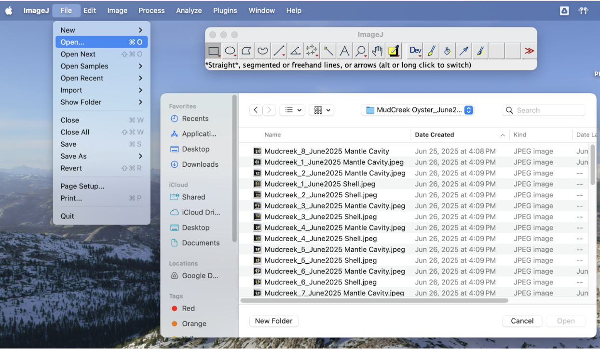

### Mud blister worms—what are they?

*Polydora websteri* are small marine worms that burrow into the shells of oysters and other bivalves, creating mud-filled blisters. The blisters appear as black shadows or as raised patches of pearlescent new shell as the oyster tries to protect itself from the parasite, but they always start from the edge of the shell. The worm is typically less than 2 cm in length. Blister worms burrow exclusively into the shell of the oysters because they use it for protective housing, not as a food source. 

### Boring sponge—what is it?

They are a species of demosponge called *Cliona celata* that burrows into the shells of marine organisms such as oysters, clams, and corals, as well as other calcium carbonate structures. The small circular holes they bore into the oyster shell weaken them, making them vulnerable to predators or other environmental stressors. In extreme cases, this can eventually kill the host organism. The boring holes typically originate at the umbo and radiate out towards the edge of the shell. 

## 1. Taking shell pictures
### Materials
- Camera/phone 
- Tripod
- Solid colored cloth material
	- Should be a color not seen in the oyster shell, easier for processing using macros
- Ruler 
- External light source (not your camera flash) 
- Label printed on underwater paper with oyster ID information
	- Year_Month_Site_Num
- Small ziplock bags
- *Optional*: one set of R and L labels to mark right and left valve

### Preparation
1. Oyster shells must first be cleaned of organic matter and excess tissue using methods such as scrubbing with a stiff brush or steel wool and rinsing with cold tap water
	- **If processing in the lab**, it's likely the shells will be frozen and need to be thawed first
	- **If processing in the field**, the scrubbing should be done before shucking
2. Take your tray and cover it with the cloth, and set up the ruler on the end of the cloth
3. Attach the phone or camera to the tripod and adjust the tray so that it fills the whole screen
	- It can help to place something under the tray to move it closer to the lens if your tripod is long
### Photographing
1. Pat shells dry to remove any excess water—the glare of the water can cause shadows that will look like mud blisters
2. Set the camera zoom to 2x or 2.2x , depending on the shell size—have enough room to see details but they shouldn't be touching any other objects on the cloth
	- On an iPhone, the square setting provides precise edges to view the entire tray and can be easier to focus on the shells
3. Position the shells as seen in the example below:

> Needs photo! But understand if you're gonna figure out the new camera set up first with the  canvas Teresa sent us 

4. If using an iPhone, hold the shell on the touch screen that has the most visual contrast between the two on the camera, and let the AE/AF lock (iPhone) and take the photo. 
5. Check the image one last time without moving the camera/phone and then take the picture
	- **IMPORTANT!** To save time when analyzing photos, do not move the tripod or zoom in/out between pictures as this will change the scale of the oyster shell! You want the pictures to be uniform and once you like the first picture
6. Flip over the shells and repeat steps 2-4 so you end up with both exterior and interior photos
7. Once all shells have been photographed you should upload these immediately to the Google Drive
	- Re-label photos: Year_Month_Site_Num

**If processing in the lab**, proceed to the drying section. 
**If processing in the field**, store the shells in individual ziplock bags—make sure to include the ID label, and store at -20ºC

## 2. Drying and weighing
*Note: if shells are coming out of the freezer for this part, they should be completely thawed and dried with a rag/paper towel before proceeding*
### Materials
- Tray
- Photographed oyster shells
- Drying oven
- Weigh boat
- Scale
### Drying
1. Place oyster shells face up with their unique ID labels on a tray

> Note that "top up" isn't necessarily intuitive instructions (changed to face up)

2. When the tray is completely full place the shells into a 55-65ºC drying oven (Olsen 502)
3. Rinse out the small ziplock bags and air dry them on the drying rack above the sink 
	- We love sustainability!  
4. After 72 hours, remove shells from drying oven to immediately weigh
### Weighing
1. Place a large weigh boat on the scale and tare the scale
	- Ideally we want at least two decimal points of accuracy
2. Place both valves of an oyster on the weigh boat and record the ID and weight in grams
3. Return the oyster shells and ID label to one of the dry, rinsed ziplock bags; store at room temperature

## 3. Photo analysis using ImageJ
### Preparation
*Note: do the following steps every time you open ImageJ after quitting the app, regardless of if you are taking general measurements or working on the macroparasite analysis*

1. Make sure all photos are relabeled to make analysis easier and faster 
	- Re-label photos: Year_Month_Site_Num_Interior/Exterior

> See how here I was able to be more generic about what the label looks like? But also, do you still label everything shell vs. mantle cavity? Going forward we should change to interior vs. exterior again to be extra obvious

2. Download and open ImageJ
	- *Recommended:* connect laptop to a second monitor or tablet
3. With ImageJ open, click File > Open > Folder > Image

4. Once you have the you have the folder open you can switch to the next picture easily by going to File_Open Next

****
4. Using the line tool, draw a line that is one inch on the ruler and then click Analyze > Set Scale and change the following settings:
	- Known distance: 1
	- Unit of length: inch
	- **Important!** Only check the "Global" box if all photos were taken on the same day with the same camera set up 
	

### General measurements!
1. Use the line tool to draw the max **shell height**, then hit M on your keyboard a window will pop up with the measurements 

2. Record this data and then using the same tool, draw the max **shell width** and record that measurement as well****

3. When finding the **shell area** you will use the polygon tool to trace along the outside edge of the whole oyster shell and then hit M and it will calculate the measurement like the length and width
![[../Images/ImageJ_area.png]]

#### Macros 

  
### Mud blister worms
#### Identification
The blisters from the Mud blister worms are pockets of mud and debris located on the inside of an oyster's shell, which bores into the shell. The oyster responds to the “irritation” by secreting layers of shell to build a protective barrier around the worm, forming the blister. When looking at this in the sense of data collection, we are only looking at the dark brown or black U-shaped blister on the inside of the shell. There will always be an entrance and exit to these. Not all shells that have “new shell” will be a blister, so judgment calls are important. 
![[../Images/MudBlisters2.png]]
	Outlined in yellow are dark blisters that have a confirmed entrance and exit. The yellow arrows do indicate a blister but there is noentrance or exsit which indicates that its an old blister and is not to be counted. We are only intrested in active infestation. The red a
#### Measurement
1. Working only with the interior shell photos, when you identify a blister, use the freehand tool to trace the whole perimeter and then hit M to measure the area. When having a big blister it is easier to use the polygon tool and when its smaller its easier to use the free hand because of the small size. 
![[../Images/MudBlister1.png]]
2. Record how many blisters there are on either shell; in this example the right valve has 8 and the left valve has 2

### Boring sponge
#### Identification
Focus first on the left valve, as this shell often shows the most damage. If there is any crumbling of the shell near the umbo, zoom in and see if there are any small holes associated with it. Use the hand tool to help move the image around when zoomed in. Tell-tale signs of boring sponge are circular holes, discoloration (yellow or orange), and “honeycomb” patterns, which are more prominent on the interior photos. 
![[../Images/BoringSponge2.png]]

The yellow arrow pointing to the umbo on the left valve is damaged and shows a dark orange area which is a part of the boring sponge. The other yellow arrow pointing to the fringe has no holes which is why it isn't counted in the area. 
![[../Images/BoringSponge1.png]]
	Note the “honeycomb” pattern, this is a heavy infestation. 

#### Measurement
1. Working only with the exterior shell photos, use the freehand tool or, for larger areas, use the polygon tool to trace the entire perimeter of boring sponge and then hit M to measure the area. You can use the free hand or the polygon tool to measure the area for the boring sponge.
2. Add all collected data to the data sheet and upload to github.

